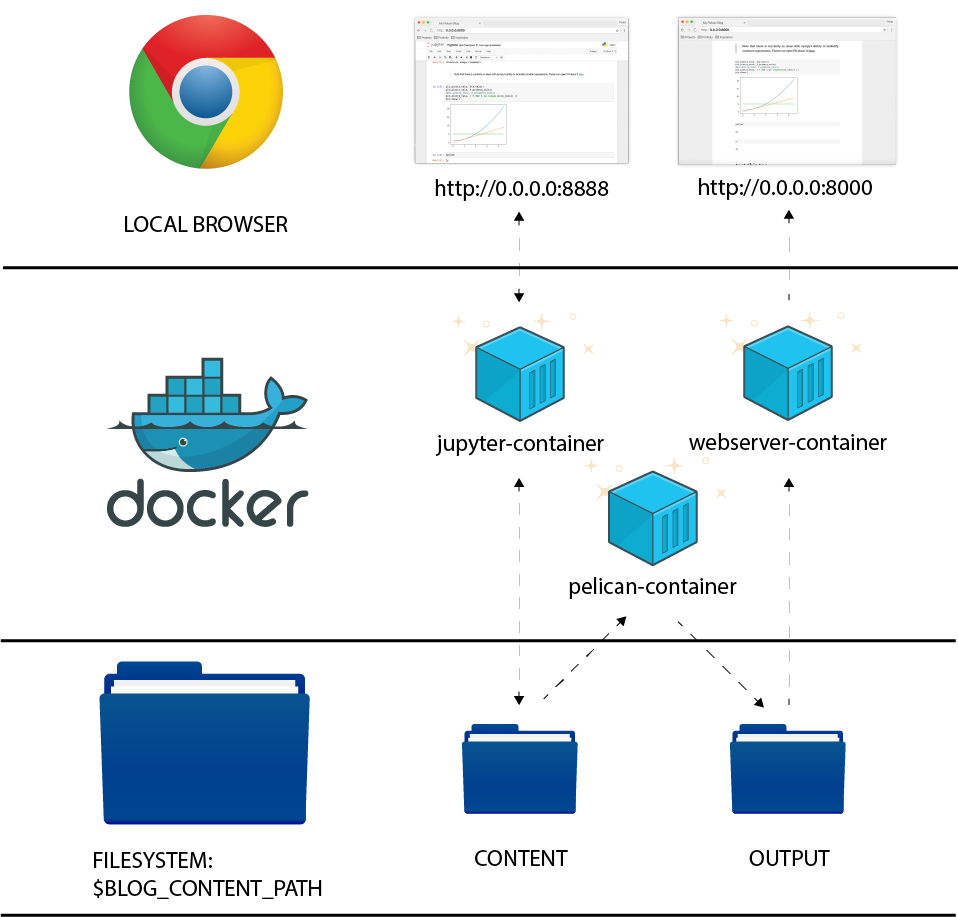

jupyter-blog
---------------------

## Storing And Working With Blog Content
This repo exists as a general purpose build environment and example for blogging with pelican and jupyter. As such, the intention here is that many different blogs can run this build pipeline over their respective assets. In my personal case, I have my blog content in a separate repo.


## How This Repo Is Organized
This repo contains a composition of 3 Docker containers that work in concert to allow users to create blog posts and content from Jupyter notebooks. The three containers are as follows:

1. **Jupyter container:** This contains a pre-configured Jupyter environment with some critical Python packages pre-installed. It will automaticappy boot up and become accessible at localhost on port `8888`. You may also choose to use your own Jupyter environment in which case refer to the section entitles "Using your own Jupyter environment" below.

2. **Pelican container:** This container contains the [pelican](https://github.com/getpelican/pelican) static site generator which runs and watches your content directory. Any time new content is saved there, it will automatically rebuild the site for live preview.

3. **Webserver container:** This contaner contains [gulp-server-livereload](https://github.com/hiddentao/gulp-server-livereload) which sits in your local `output` directory watching for new output from pelican and automatically refreshing your browser to serve updated content at port `8888`.

### Architecture
***
<p align="center">
  
</p>

## Setup
### Default
In order to get started, you simply have to have Docker installed and have an internet connection active. Then, all you have to do is run `docker-compose -d up` from within this directory, wait while it downloads resources and builds the required containers and then navigate to `http://0.0.0.0:8888` for Jupyter and `http://0.0.0.0:8000` for your live preview.

### Custom
#### Blog Content
When booted up this composition will look for an environment variable called `BLOG_CONTENT_PATH`. If not set (which, in the basic scenario, it wouldn't be), this will automatically set this variable to the `demo-content` folder in this directory. This is great to get started but, as you progress with your own blog you'll want to store your content in it's own separate directory. For me, I have another git repository where all of my blog content is stored (this includes, posts, `.ipynb` files, css, js etc....) The `demo-content` folder here serves as a good reference for how you should organize your blog content.  It should basically be laid out like this:

```
├── content
│   ├── pages
│   │   └── about.md
│   └── posts
│       ├── mypost.ipynb
│       └── mypost.ipynb-meta
├── output
│   └──... <THIS IS POPULATED AUTOMATICALLY BY PELICAN>
├── pelicanconf.py
├── plugins
│   └──...<IPYNB PLUGIN>
├── requirements.txt
└── themes
    └── <YOUR THEME FOLDER>
        ├── static
        │   └──...<THEME CSS AND JS>
        └── templates
            └──... <THEME JINJA TEMPLATES>
```

#### Using Your Own Jupyter Environment
You might have noticed that this repo comes with two separate compose files. By default, `docker-compose.yml` is run which inherits the configuration for the `pelican` and `webserver` containers from a parent file `docker-compose-without-jupyter.yml` and then adds the jupyter configuration. If you have your own Jupyter environment (which could be in a container but certainly doesn't have to be), you can run this command instead to only build and boot the pelican and webserver services:

`docker-compose -f docker-compose-without-jupyter.yml -d up`

Then, simply run your Jupyter environment from the `BLOG_CONTENT_PATH`.

> NOTE: This will still look for a `BLOG_CONTENT_PATH` environment variable and will still use this repo's `demo-content` folder by default. You are, of course, free (encouraged actually) to set your own: `export BLOG_CONTENT_PATH=/path/to/your/content`

### Creating Blog Posts From Jupyter Notebooks:
1. Create any notebooks you want in the `content` folder. Again, this is `${BLOG_CONTENT_PATH}/content`
> Remember to create corresponding `.ipynb-meta` files.


### Importing and Modifying Theme Structure
This blog uses the wonderful [martin-pelican](https://github.com/cpaulik/martin-pelican) theme. It's been copied into this repo and committed here because it contains several specific changes that aren't in master. The majority of these are just customizations of the various Jinja templates.

One other important change is the consequence of the transition to pelican v 3.7 which introduced a backwards-incompatible change to how pages were referenced in jinja. Where traditionally, templates could use `pages` and `PAGES` interchangeably (e.g. ``), 3.7 requires them to use only `pages` (lowercase) when iterating over static pages, you can read more about more about that  [here](http://docs.getpelican.com/en/latest/faq.html#since-i-upgraded-pelican-my-pages-are-no-longer-rendered). Long story short, the `martin-pelican` theme templates used here have that alteration.

In general, adding/changing themes in Pelican is pretty simple, you can create your own or pull from a rather large selection of wonderful pre-made themes which you can browse at the [pelican-themes](https://github.com/getpelican/pelican-themes) GitHub repo. All that's required to incorporate a theme is to acquire the appropriate static assets. Themes come with their own Jinja templates which you can use or change at will. The simplest way to get a theme's static assets is just to clone the `pelican-themes` github repo and then either:

* use the `pelican-themes` utility to load the theme like so: `pelican-themes -i <path-to-theme>` and confirm that it was loaded  with `pelican-themes -l`. Then you can refer to it's theme name directly in your `pelicanconf.py` like so: `THEME ="martin-pelican"`.

* just directly refer to the assets by their full path in your `pelicanconf.py`. This would be something like `THEME = "/jupyter-blog/themes/martin-pelican"`

Following that, customizing your theme is as simple as modifying the various Jinja templates and creating and referring to variables in your `pelicanconf.py`.

### Other Tips
When using the `pelican-ipynb` plugin, there are a few other stylistic modifications that are recommended. In this repo, these are included in a `custom.css` file imported in the `base.html` template. The modifications include reducing the font-size of the `code_cell`s and hiding the `prompt` elements.
